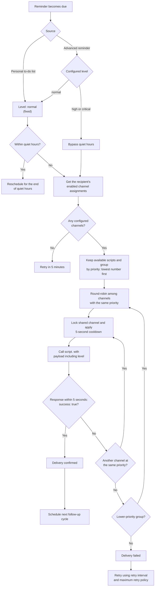

# Architecture and channel contract

Person config entries own a configuration device, local to-do entity, and persistent store. Every pending to-do item has an internal stable reminder ID and generation. An edit, completion, deletion, or reopening invalidates earlier work, preventing late responses from rescheduling stale content.

Every advanced reminder is a separate config entry and logical device. It persists one shared active occurrence with independent delivery state per recipient, plus a local-date completion marker for the **Completed today** switch. Completion through `ha_reminder.interact` is idempotent and invalidates all recipient work. Editing, disabling, expiring, or reloading the device also increments the occurrence generation so obsolete queued work cannot affect the replacement schedule.

The delivery engine starts at the lowest assigned channel priority. A channel is a reusable `script.*` configuration; assignments attach it to a person with a priority. Equal priorities are round-robin alternatives. The first response with a boolean `success: true` finishes a cycle. Every other response, timeout, exception, missing script, or `success: false` is a failure and falls through to the next channel.

Channel scripts receive `reminder_id`, `person_entity_id`, `todo_entity_id`, `todo_item_uid`, `title`, `description`, `level`, `attempt`, `channel_priority`, `created_at`, and `due_at`. A manual channel test also sends `is_test: true`. Scripts must return a mapping containing a boolean `success`; `reason` is optional when it is false. The integration calls each script directly through its named `script.<name>` action so Home Assistant can return that mapping; `script.turn_on` cannot be used for this contract.

The included [notification-channel script blueprint](../blueprints/script/ha_reminder/notification_channel.yaml) is the standard implementation for one selected `notify` entity. It returns success after Home Assistant accepts the notification action; delivery confirmation from an external provider remains provider-specific.

All timestamps are persisted as UTC ISO timestamps. The scheduler uses local time for quiet-hours and the 09:00 date-only due reference. Normal reminders defer during quiet hours, without advancing intervals or retries. Advanced schedules resolve Morning, Afternoon, and Evening to 09:00, 13:00, and 18:00. Exact-time reminders can explicitly continue through their follow-up intervals until completion or the selected expiration policy.

## Delivery flow by notification level

Channel priority and notification level are independent. Priority determines the
order in which a person's enabled channels are tried; the notification level
only determines whether quiet hours suppress a delivery. To-do reminders always
use `normal`. Advanced reminders can use `normal`, `high`, or `critical`;
`high` and `critical` bypass quiet hours while retaining the same channel
priority and fallback policy.

